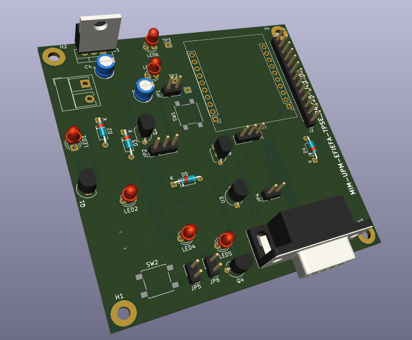
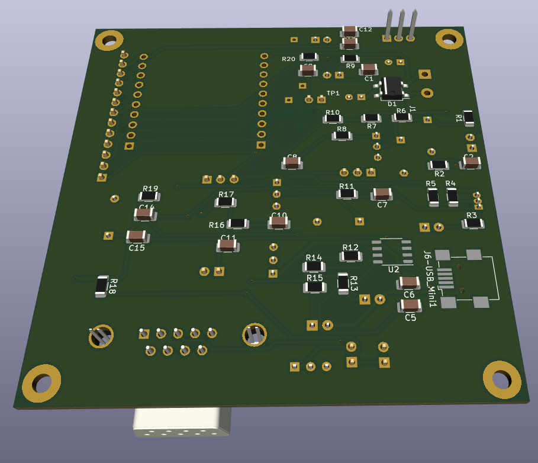
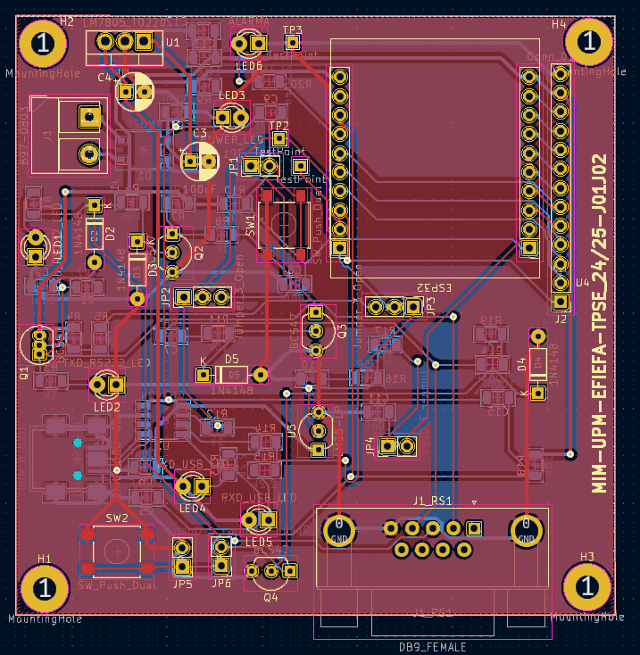
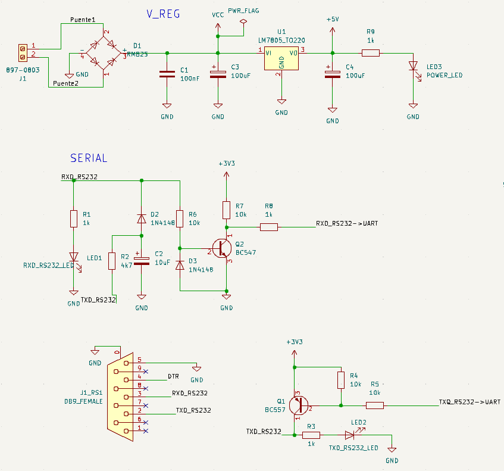
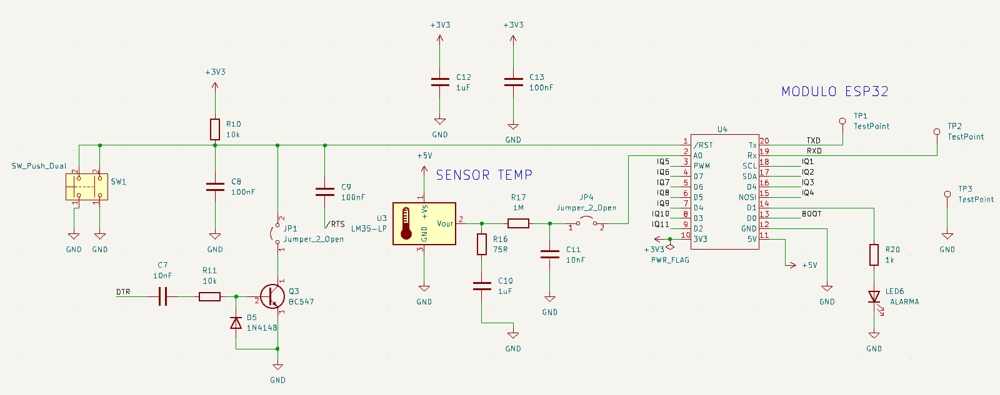
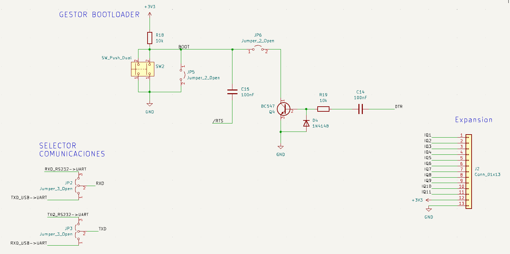

# ESP32 Temperature Web Server PCB

Custom two-layer PCB designed in KiCad for an ESP32-based temperature monitoring system.  
The board measures temperature using an LM35 analog sensor and allows the measured value to be monitored through a web interface served by the ESP32 module.

This project focuses on the complete hardware development flow: schematic capture, PCB layout, manufacturing files generation, board assembly and laboratory validation.

## Project Overview

The goal of this project was to design and validate a functional printed circuit board for an IoT temperature monitoring device.

The system includes:

- ESP32 module as the main processing and communication unit
- LM35 analog temperature sensor
- USB-to-UART interface based on CH340N
- RS232 communication interface
- Communication selection through jumpers
- 5 V regulated power supply stage
- Bootloader and reset management circuitry
- Alarm LED output
- Expansion connector for additional ESP32 signals
- Two-layer PCB designed in KiCad
- SMD and through-hole component assembly
- Laboratory functional validation

## PCB Preview

### 3D Render





### PCB Layout



### Assembled Board


### Web Interface


## Hardware Architecture

The schematic is divided into several functional blocks:

### Power Regulation

The power stage provides the regulated supply required by the system.  
It includes input filtering, a linear voltage regulator and a power indicator LED.



### ESP32 Module

The ESP32 module acts as the core of the system.  
It is connected to the temperature sensing stage, UART communication lines, boot/reset circuitry and alarm LED.



### Temperature Sensor

The board uses an LM35 analog temperature sensor.  
Its output voltage is proportional to the measured temperature and is connected to the ESP32 analog input through a simple conditioning/filtering stage.

### USB Interface

A CH340N USB-to-UART converter is used to provide serial communication through the USB connector.


### RS232 Interface

The board also includes an RS232 communication stage with level adaptation to interface with the ESP32 UART signals.

### Communication Selection

Jumpers are used to select whether the ESP32 UART lines are connected to the USB interface or to the RS232 interface.

### Bootloader and Reset Management

The design includes manual and automatic boot/reset circuitry, allowing the ESP32 to start normally or enter programming mode.



### Expansion Connector

An expansion connector exposes additional ESP32 pins for future extensions or external peripherals.

## Repository Structure

```text
.
├── hardware/
│   ├── kicad/              # KiCad project files
│   └── fabrication/        # Gerber and drill files
├── docs/
│   └── images/             # Schematic captures, PCB renders and photos
├── bom/                    # Bill of materials, if available
├── README.md
└── .gitignore
```

## KiCad Design

The hardware design was developed using KiCad and includes:

- Schematic capture
- Custom symbol/footprint handling
- Two-layer PCB layout
- Functional block-based component placement
- Top and bottom copper zones connected to GND
- SMD and through-hole component placement
- Mounting holes
- Silkscreen identification
- Design files ready for manufacturing

## Manufacturing Files

The `hardware/fabrication/` folder contains the production files required to manufacture the PCB:

- Top and bottom copper layers
- Top and bottom solder mask
- Top and bottom silkscreen
- Solder paste layers
- Board outline
- PTH and NPTH drill files
- Gerber job file

## Assembly

The PCB was manufactured externally and later assembled in the laboratory.  
The assembly process included both SMD and through-hole components.

Main assembled elements:

- ESP32 socket/header area
- USB connector
- DB9 RS232 connector
- Voltage regulator
- CH340N USB-to-UART converter
- LM35 temperature sensor socket
- BJTs and diode-based interface circuitry
- Jumpers and test points
- Indicator LEDs
- Mounting holes

## Validation

The assembled PCB was validated through several checks:

- Power supply verification
- 5 V regulator output measurement
- ESP32 module power-up test
- USB communication test
- RS232 communication test
- UART signal routing through jumpers
- Web server access from a mobile browser
- Temperature visualization
- Configurable threshold test
- Alarm LED activation when the temperature exceeds the configured threshold

## Functional Test

During the final test, the ESP32 web interface displayed:

- Current time
- Measured temperature
- Configurable temperature threshold
- Alarm message when the threshold was exceeded
- Button to clear the alert

Example web interface:


## Skills Demonstrated

- PCB design with KiCad
- Schematic capture
- PCB layout and routing
- Gerber and drill file generation
- SMD soldering
- Through-hole soldering
- ESP32-based IoT hardware
- Analog sensor integration
- USB-to-UART communication
- RS232 interface design
- Boot/reset circuit integration
- Laboratory hardware validation
- Multimeter and oscilloscope-based testing
- Technical documentation

## Notes

This repository focuses on the hardware design, PCB manufacturing files and validation process.  
Firmware or software not originally developed by the author is not included.

## Author

Marcos Indiano  
Electronic Communications Engineering student  
Universidad Politécnica de Madrid
